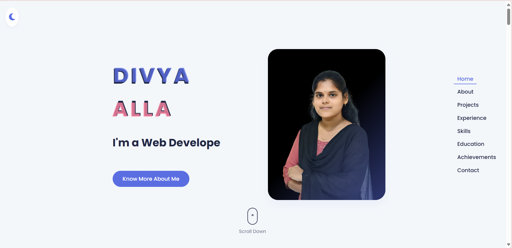

<h1 align="center">✨ Divya Alla — Personal Portfolio Website ✨</h1>

  <b>🚀 A sleek and modern portfolio website that showcases my journey as a Front-End Developer</b> 
  Designed to highlight my skills, projects, and achievements in a clean, minimal, and responsive way.

---

  

---

## 🪄 Overview

My **Personal Portfolio Website** is a digital reflection of who I am —  
a passionate **Front-End Developer** who loves transforming ideas into interactive experiences.  

It’s designed with simplicity, speed, and elegance in mind — giving visitors an engaging look at my projects and professional background.

---

## 🎯 Features

- 🧭 **Elegant Landing Page** with smooth navigation  
- 💼 **Projects Showcase** with live demos and code links  
- 🧠 **Skills, Education & Experience** neatly structured  
- 💬 **Interactive Contact Section** to connect easily  
- ⚡ **Fully Responsive Design** that works on all devices  
- 🌙 **Clean Aesthetic with Subtle Animations**

---

## 🛠️ Tech Stack

| Category | Technologies |
|-----------|---------------|
| **Frontend** | HTML5, CSS3, JavaScript (ES6) |
| **Design** | Flexbox, Grid, Responsive Media Queries |
| **Deployment** | GitHub Pages |

---

## 📸 Preview

  

---

## 🚀 How to View Locally

# Clone this repository
git clone https://github.com/DivyaAlla22/Portfolio-Website.git

# Open the folder
cd Portfolio-Website

# Open index.html in your browser
💡 Future Improvements
🌈 Dark & Light Mode

📝 Blog Integration

🎨 Animated Project Gallery

🔗 API-based Contact Form

👩‍💻 About the Developer
Hi! I’m Divya Alla, an aspiring Front-End Developer passionate about building creative and impactful digital experiences.
I enjoy designing user interfaces that are simple, fast, and visually appealing — powered by clean and efficient code.

  <b>💬 Let’s Connect</b>  

  

  

  

  <i>✨ Designed & Developed with ❤️ by <b>Divya Alla</b> ✨</i>

